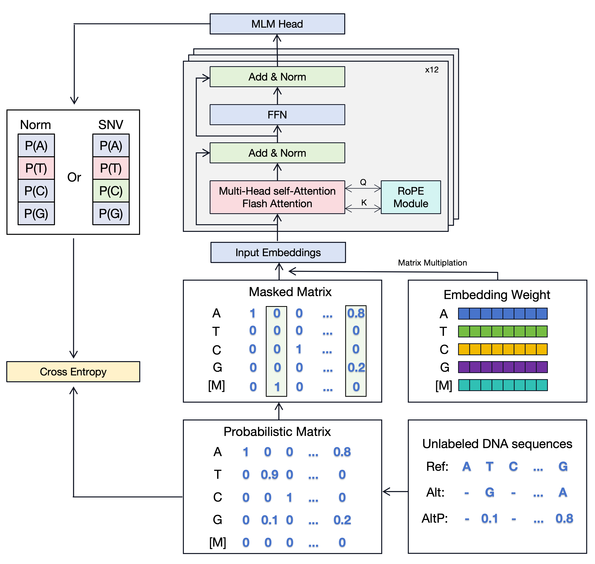
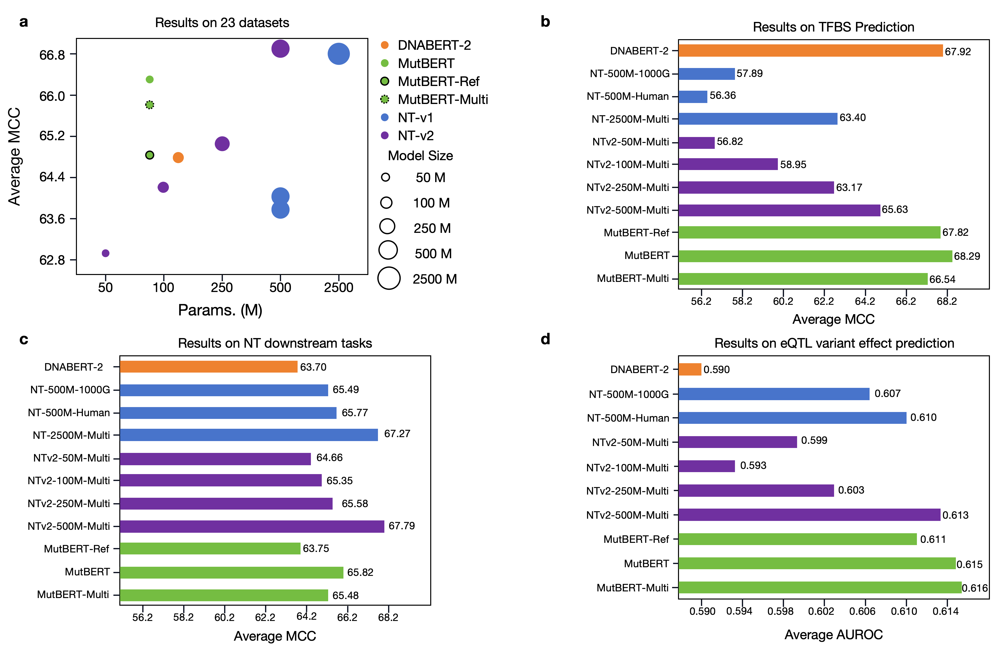

# MutBERT: Probabilistic Genome Representation Improves Genomics Foundation Models

The repo contains the official implementation of [MutBERT: Probabilistic Genome Representation Improves Genomics Foundation Models](https://www.biorxiv.org/content/10.1101/2025.01.23.634452v1).

## Contents

  - [1. Introduction](#1-introduction)
  - [2. Model and Results](#2-model-and-results)
  - [3. Setup environment](#3-setup-environment)
  - [4. Quick Start](#4-quick-start)
    - [4.1 Load Tokenizer and Model](#41-load-tokenizer-and-model)
    - [4.2 Get the embeddings](#42-get-the-embeddings)
    - [4.3 With RoPE scaling](#43-with-rope-scaling)
  - [5. Pre-Training](#5-pre-training)
    - [5.1 Pre-Train Data](#51-pre-train-data)
    - [5.2 Pre-Train Code](#52-pre-train-code)
  - [6. Finetune](#6-finetune)
    - [6.1 Evaluate models on TFBS](#61-evaluate-models-on-tfbs)
    - [6.2 Evaluate models on NT-downstream Tasks](#62-evaluate-models-on-nt-downstream-tasks)
    - [6.2 Evaluate models on eQTL-Vep Tasks](#62-evaluate-models-on-eqtl-vep-tasks)
  - [7. Citation](#7-citation)


## 1. Introduction

Understanding the genomic foundation of human diversity and disease requires models that effectively capture sequence variation, such as single nucleotide polymorphisms (SNPs). While recent genomic foundation models have scaled to larger datasets and multi-species inputs, they often fail to account for the sparsity and redundancy inherent in human population data, such as those in the 1000 Genomes Project. SNPs are rare in humans, and current masked language models (MLMs) trained directly on whole-genome sequences may struggle to efficiently learn these variations. Additionally, training on the
entire dataset without prioritizing regions of genetic variation results in inefficiencies and negligible gains in
performance.

**MutBERT**, a probabilistic genome-based masked language model that efficiently utilizes SNP information from population-scale genomic data. By representing the entire genome as a probabilistic distribution over observed allele frequencies, MutBERT focuses on informative genomic variations while maintaining computational efficiency.



## 2. Model and Results

The pre-trained models is available at Huggingface as `JadenLong/MutBERT`. [Link to HuggingFace ModelHub](https://huggingface.co/JadenLong/MutBERT).





## 3. Setup environment

```bash
# create and activate virtual python environment
conda create -n mutbert python=3.12
conda activate mutbert

# install required packages
python3 -m pip install -r requirements.txt
```

## 4. Quick Start

Our model is easy to use with the [transformers](https://github.com/huggingface/transformers) package.

### 4.1 Load Tokenizer and Model

To load the model from huggingface:

```python
from transformers import AutoTokenizer, AutoModel

model_name = "JadenLong/MutBERT"
tokenizer = AutoTokenizer.from_pretrained(model_name)
model = AutoModel.from_pretrained(model_name, trust_remote_code=True)
cls_model = AutoModelForSequenceClassification.from_pretrained(model_name, trust_remote_code=True, num_labels=2)
```

The default attention is flash attention("sdpa"). If you want use basic attention, you can replace it with "eager". Please refer to [here](https://huggingface.co/JadenLong/MutBERT/blob/main/modeling_mutbert.py#L438).

### 4.2 Get the embeddings

To get the embeddings of a dna sequence

```python
import torch
import torch.nn.functional as F

from transformers import AutoTokenizer, AutoModel

model_name = "JadenLong/MutBERT"
tokenizer = AutoTokenizer.from_pretrained(model_name)
model = AutoModel.from_pretrained(model_name, trust_remote_code=True)

dna = "ATCGGGGCCCATTA"
inputs = tokenizer(dna, return_tensors='pt')["input_ids"]

mut_inputs = F.one_hot(inputs, num_classes=len(tokenizer)).float().to("cpu")  # len(tokenizer) is vocab size
last_hidden_state = model(inputs).last_hidden_state   # [1, sequence_length, 768]
# or: last_hidden_state = model(mut_inputs)[0]        # [1, sequence_length, 768]

# embedding with mean pooling
embedding_mean = torch.mean(last_hidden_state[0], dim=0)
print(embedding_mean.shape) # expect to be 768

# embedding with max pooling
embedding_max = torch.max(hidden_states[0], dim=0)[0]
print(embedding_max.shape) # expect to be 768
```
### 4.3 With RoPE scaling

Allowed types for RoPE scaling are: `linear` and `dynamic`. To extend the model's context window you need to add rope_scaling parameter.

If you want to scale your model context by 2x:

```python
from transformers import AutoModel
model = AutoModel.from_pretrained(model_name,
                                  trust_remote_code=True,
                                  rope_scaling={'type': 'dynamic','factor': 2.0}
                                  ) # 2.0 for x2 scaling, 4.0 for x4, etc..
```


## 5. Pre-Training
### 5.1 Pre-Train Data

The **RAW** training data is available:
- [mutation data](https://ftp.1000genomes.ebi.ac.uk/vol1/ftp/data_collections/1000G_2504_high_coverage/working/20220422_3202_phased_SNV_INDEL_SV/): Download `*.vcf.gz`.
- [Human Reference Genome](https://hgdownload.soe.ucsc.edu/goldenpath/hg38/bigZips/): Download `hg38.fa.gz`

After download raw data, we used [seqkit](https://bioinf.shenwei.me/seqkit/) to process VCF files. [Link to script](./1-prepare_data/vcf2csv.sh)

You can follow 7 steps to [prepare data](./1-prepare_data/preprocess_data.py):

0. csv_post_process(): add header of csv files
1. fa2npy(): extract sequence data from hg38.fa.gz, save as chr_name.npy
2. split_by_n(): split sequence data by "N" from chr_name.npy, save as chr_name_part_i.npy
3. create_sm_matrix(): 3rd STEP: map str to float number, create smooth matrix from chr_name_part_i.npy (str) and clean.chr_name.csv, save as chr_name_part_i.npy (float)
4. cat_all_npy(): concatenate all the interval smooth matrix from chr_name_part_i.npy (float), save as train_data.npy and test_data.npy
5. get_range_list(): Retrieve the list of available segment ranges.
6. get_start_indices(): Generate the list of available segment ranges, which will be randomly selected as starting points for pre-training.


### 5.2 Pre-Train Code

We used and modified `run_mlm_no_trainer.py` at https://github.com/huggingface/transformers/blob/main/examples/pytorch/language-modeling/run_mlm_no_trainer.py by importing the `RoPEBertForMaskedLM` from https://huggingface.co/JadenLong/MutBERT/blob/main/modeling_mutbert.py.

## 6. Finetune

### 6.1 Evaluate models on TFBS

We use GUE (proposed by [DNABERT-2](https://github.com/MAGICS-LAB/DNABERT_2)) to conduct TFBS evaluation.

Please first download the GUE dataset from [here](https://drive.google.com/file/d/1GRtbzTe3UXYF1oW27ASNhYX3SZ16D7N2/view?usp=sharing). Then [run the scripts](./3-finetune-code/TFBS/scripts/) to evaluate on all the tasks. 


### 6.2 Evaluate models on NT-downstream Tasks

We use [NT-downstream Tasks](https://huggingface.co/datasets/InstaDeepAI/nucleotide_transformer_downstream_tasks_revised) to conduct this evaluation.

[Run the scripts](./3-finetune-code/NT-downstream/scripts/) directly, it will automatically download the datasets and perform finetuning.

### 6.2 Evaluate models on eQTL-Vep Tasks

We used and modified `vep_embeddings.py` and `vep_svm.ipynb` at [Caduceus Model](https://github.com/kuleshov-group/caduceus/tree/main).

[Run the scripts](./3-finetune-code/eQTL_VEP/scripts/) directly, it will automatically download the datasets and perform finetuning.

## 7. Citation

If you have any question regarding our paper or codes, please feel free to start an issue or email Weicai Long (wlong381 AT connect *dot* hkust-gz *dot* edu *dot* cn).

If you use MutBERT in your work, please kindly cite our paper:

```
@article{long2025mutbert,
  title={MutBERT: Probabilistic Genome Representation Improves Genomics Foundation Models},
  author={Long, Weicai and Su, Houcheng and Xiong, Jiaqi and Zhang, Yanlin},
  journal={bioRxiv},
  pages={2025--01},
  year={2025},
  publisher={Cold Spring Harbor Laboratory}
}
```